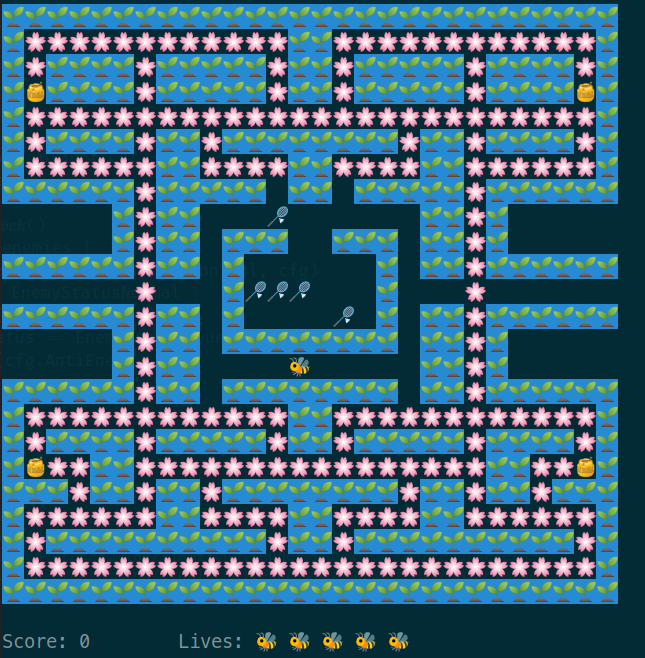
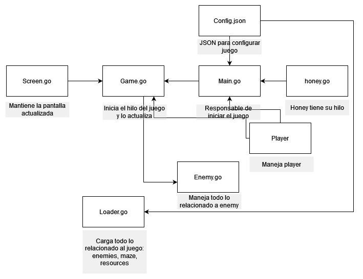
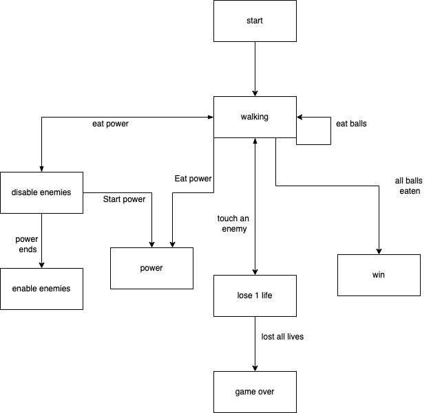

<div id="top"></div>
<!--
*** Thanks for checking out the Best-README-Template. If you have a suggestion
*** that would make this better, please fork the repo and create a pull request
*** or simply open an issue with the tag "enhancement".
*** Don't forget to give the project a star!
*** Thanks again! Now go create something AMAZING! :D
-->

<!-- PROJECT LOGO -->
<br />
<div align="center">
  <a href="https://github.com/othneildrew/Best-README-Template">
    
  </a>

  <h3 align="center">Bee PacMan</h3>
</div>
<!-- ABOUT THE PROJECT -->

## About The Project

Final Project of the course "Advanced Programming"

### Built With

- [goland](https://www.jetbrains.com/idea/download/download-thanks.html)

## Build and Run

Build the application

```
  make build
```

Test the application

```
  make test
```

Clean previous build

```
 make clean
```

## Diagrams

<div align="center">
<h3 align="center">Activity Diagram</h3>
<a href="https://github.com/othneildrew/Best-README-Template">
 
</a>
<h3 align="center">Secuential Diagram</h3>
<a href="https://github.com/othneildrew/Best-README-Template">
 
</a>
</div>

## Usage

The keys are: UpArrow, DownArrow, LeftArrow and RightArrow

Run the game with the command:

```
go run main.go < 1 - 12 >

```
If you want to end the game press the `esc` key.
<!-- MARKDOWN LINKS & IMAGES -->
<!-- https://www.markdownguide.org/basic-syntax/#reference-style-links -->

[contributors-shield]: https://img.shields.io/github/contributors/othneildrew/Best-README-Template.svg?style=for-the-badge
[contributors-url]: https://github.com/othneildrew/Best-README-Template/graphs/contributors
[forks-shield]: https://img.shields.io/github/forks/othneildrew/Best-README-Template.svg?style=for-the-badge
[forks-url]: https://github.com/othneildrew/Best-README-Template/network/members
[stars-shield]: https://img.shields.io/github/stars/othneildrew/Best-README-Template.svg?style=for-the-badge
[stars-url]: https://github.com/othneildrew/Best-README-Template/stargazers
[issues-shield]: https://img.shields.io/github/issues/othneildrew/Best-README-Template.svg?style=for-the-badge
[issues-url]: https://github.com/othneildrew/Best-README-Template/issues
[license-shield]: https://img.shields.io/github/license/othneildrew/Best-README-Template.svg?style=for-the-badge
[license-url]: https://github.com/othneildrew/Best-README-Template/blob/master/LICENSE.txt
[linkedin-shield]: https://img.shields.io/badge/-LinkedIn-black.svg?style=for-the-badge&logo=linkedin&colorB=555
[linkedin-url]: https://linkedin.com/in/othneildrew
[product-screenshot]: images/screenshot.png

